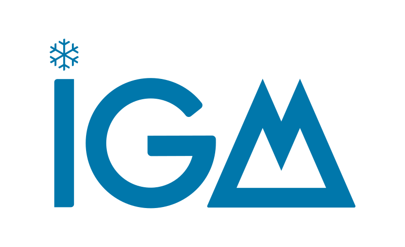

### <h1 align="center" id="title">The Instructed Glacier Model (IGM) </h1>
 
 

    

# Overview    

The Instructed Glacier Model (IGM) is an **open-source Python package**, which permits to simulate **3D glacier evolution** accounting for the coupling between ice thermo-dynamics, surface mass balance, and mass conservation. IGM features:

- **Accessibility and modularity:** IGM is implemented in the most popular programming language -- Python -- and takes large benefit of existing tools such as [OGGM](https://oggm.org/). It is organized **module-wise** to facilitate coupling, customization and commmunity development. For simplicity, IGM uses a horizontal regular grid for numerical discretization and therefore deals with **2D gridded input and output data**.

- **State-of-the-art physics:** IGM implements mass conservation, **high-order** 3D ice flow mechanics, an **Enthalpy** model for the thermic regime of ice, **melt/accumulation surface mass balance** model, and other glaciological processes.

- **Computational efficiency:** Thanks to the **TensorFlow library**, mathematical operations are **fully-vectorized**. This permits tremendous **speed-ups on GPU**. **Physics-informed deep learning** is used as an alternative to numerical solvers for modelling ice flow physics in a vectorized way. While GPU are highly-recommended for modelling large domain / high resolution, IGM runs fairly well on CPU for individual glaciers.

- **Automatic differentiation:** TensorFlow operations are differentiable. Therefore, automatic differentiation strongly facilitates and speeds-up inverse modelling / data assimilation.
  
# Documentation

Start with the 10-min [video tutorial](https://vimeo.com/884003820). Then, all the documentation can be found on the dedicated [wiki](https://github.com/jouvetg/igm/wiki) and the the in-progress and open-to-contributions [technical paper](https://github.com/jouvetg/igm-paper/blob/main/paper.pdf).

# Discord channel

IGM has a [discord channel](https://discord.com/) for quick support, getting latest infos, exchanges with other users. To get in, please send me your discord user name at guillaume.jouvet at unil.ch to be added to the group.

# Contact

Feel free to drop me an email for any questions, bug reports, or ideas of model extension: guillaume.jouvet at unil.ch
