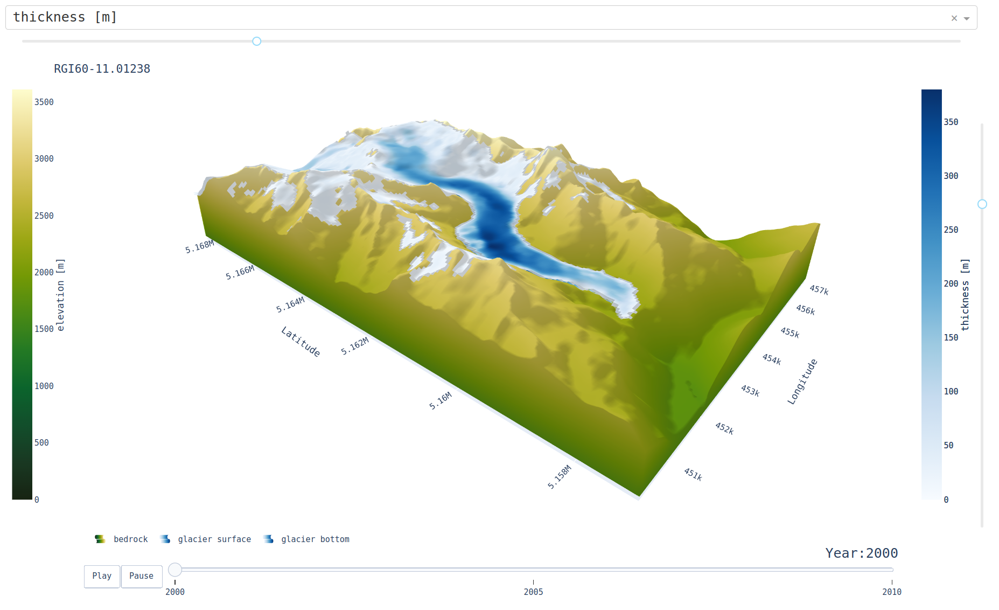

### <h1 align="center" id="title">IGM module `anim_plotly` </h1>

 <div align="center">
    
</div>

# Description:

This module permits an interactive 3D vizualization of IGM results reading the NetCDF file
produced by module `write_ncdf` based on libraries `dash` and `plotly`.
It creates a dash app that can be accessed via a browser
(the adress printed in the console is usually http://127.0.0.1:8050/). 
The app shows a 3D plot of the glacier's surface on top of the surrounding bedrock. 
The surface color shows either the ice thickness, the velocity magnitude of the surface
or the surface mass balance. Variables can be chosen in the dropdown menu.
The app also includes a slider to navigate the different time steps of the glacier simulation.

This module depends on the `dash` and `plotly` library. Therefore, you need to install it in your python environent:

```bash
pip install dash plotly
```

This module was implemented by [Oskar Herrmann](https://github.com/ho11laqe). 
# Parameters: 


|short|long|default|help|
| :--- | :--- | :--- | :--- |
|`-h`|`--help`||show this help message and exit|
||`--working_dir`|``|Working directory (default empty string)|
||`--modules_preproc`|`['oggm_shop']`|List of pre-processing modules|
||`--modules_process`|`['iceflow', 'time', 'thk']`|List of processing modules|
||`--modules_postproc`|`['write_ncdf', 'plot2d', 'print_info']`|List of post-processing modules|
||`--logging`||Activate the looging|
||`--logging_file`|``|Logging file name, if empty it prints in the screen|
||`--print_params`||Print definitive parameters in a file for record|
